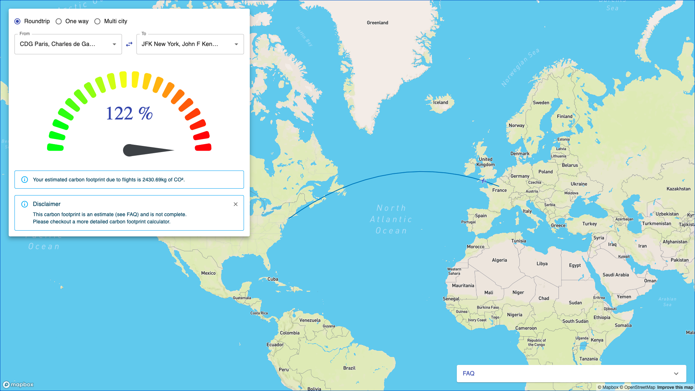

# ✈️ Flight Carbon Footprint

 

Please visit [flight-carbon-footprint.vercel.app](https://flight-carbon-footprint.vercel.app/) to estimate your carbon footprint due to flights :).

## Installation

This is a [Next.js](https://nextjs.org/) project bootstrapped with [`create-next-app`](https://github.com/vercel/next.js/tree/canary/packages/create-next-app).
After cloning the repository, simply run the development server: `yarn dev`, and open [http://localhost:3000](http://localhost:3000) with your browser to see the result.

## Disclaimer

This calculator is mostly to have a direct and visual feedback of the impact of our flights. To have a more detailed and precise estimation, please refer to a more complete calculator:

- https://footprint.wwf.org.uk/#/
- https://www.carbonfootprint.com/calculator.aspx
- https://www.nature.org/en-us/get-involved/how-to-help/carbon-footprint-calculator/

### More info

For more information about the method of computation, please contact me :).
